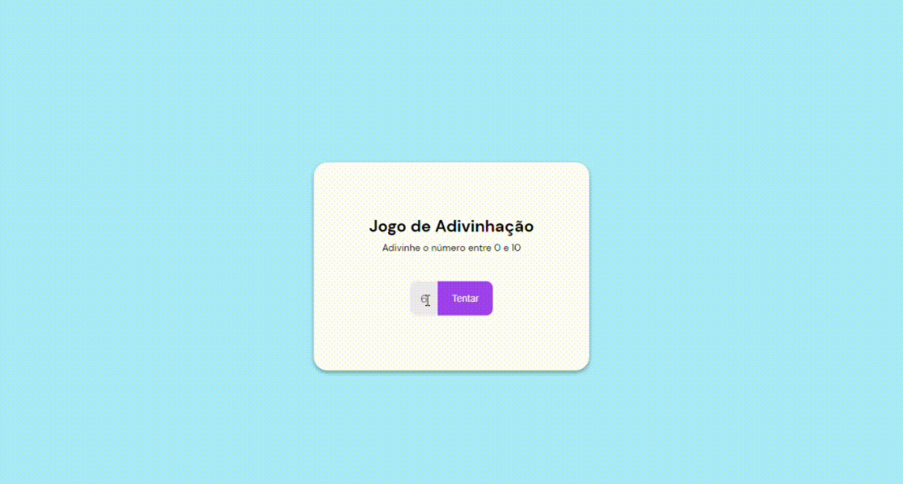

<h1 align="center"> Jogo de adivinhação </h1>

  <a href="#-tecnologias">Tecnologias</a>&nbsp;&nbsp;&nbsp;|&nbsp;&nbsp;&nbsp;
  <a href="#-projeto">Projeto</a>&nbsp;&nbsp;&nbsp;|&nbsp;&nbsp;&nbsp;

 

  

## 🚀 Tecnologias

Esse projeto foi desenvolvido com as seguintes tecnologias:

- HTML e CSS
- JavaScript
- Git e GitHub

## 💻 Projeto

"Guessing Game", é um jogo de adivinhação onde o usuário tenta adivinhar o número gerado pelo pc. É divertido, pois exige sorte, e da para jogar inúmeras vezes

Testei meus conhecimento de javascript, novas funções e novas habilidades adquiridas

Feito com ♥ by nicholasvp :wave: 
